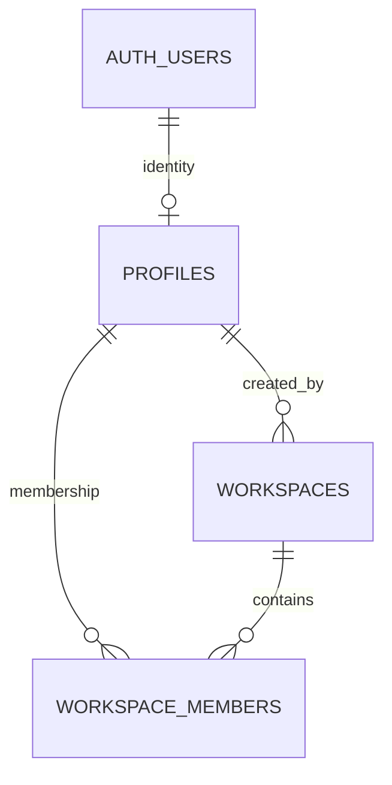

# Workspace access / RLS — 2026-10-01

이번 단계는 `profiles`, `workspaces`, `workspace_members`와 조회 권한만 구현한다. 로그인 UI·로그아웃·Dashboard는 기존 Auth 구조를 유지한다. 데이터 변경은 관리자 SQL로만 준비하며 앱에 생성·초대·역할 변경 UI나 RPC를 제공하지 않는다.

## 데이터 관계



| 테이블 | 주요 열·제약 |
| --- | --- |
| `profiles` | `id = auth.users.id` PK/FK, nullable `display_name`(1–80자), `created_at`. 이메일·비밀번호·토큰을 복제하지 않는다. |
| `workspaces` | UUID PK, `name`(공백 제외 1–80자), `created_by → profiles.id`, `created_at`. `created_by`는 생성 이력이며 조회 권한의 근거가 아니다. |
| `workspace_members` | `(workspace_id, profile_id)` 복합 PK, 두 FK, `role`=`owner`/`member`, `joined_at`. 사용자별 workspace 조회 인덱스와 workspace별 owner 최대 한 명의 unique 인덱스. |

역할은 사용자 전체가 아닌 각 workspace의 멤버십에 저장한다. 한 사용자는 여러 workspace에 가입할 수 있다. 공동 workspace는 A(owner)·B(member) 두 명으로 시작한다. DB에 두 명의 상한은 두지 않아 향후 확장할 수 있다. 이 단계에서는 두 역할 모두 멤버 조회만 가능하다. 초대·관리·쓰기 권한은 아직 부여하지 않는다.

관리자 provisioning은 한 트랜잭션에서 기존 확인 완료 Auth 사용자 두 명의 프로필, workspace, owner/member 연결을 생성한다. unique 인덱스는 owner **최대 한 명**을 보장한다. 최소 한 명의 owner 유지와 owner 이전은 현재 관리자 운영 책임이며 앱 기능으로 제공하지 않는다. 새 Auth 사용자 자동 프로필 trigger를 만들지 않아 계정 생성과 기존 Auth 흐름에 DB trigger 의존성을 추가하지 않았다.

## 정책과 차단 방식

| 테이블 | authenticated SELECT | 익명 / INSERT·UPDATE·DELETE |
| --- | --- | --- |
| `profiles` | 자기 프로필 또는 같은 workspace 멤버의 표시 정보 | 허용하지 않음 |
| `workspaces` | 현재 `auth.uid()`가 멤버로 등록된 workspace | 허용하지 않음 |
| `workspace_members` | 자신이 멤버인 workspace의 멤버십 | 허용하지 않음 |

세 테이블에 RLS를 활성화하고 기본 `PUBLIC`/`anon`/`authenticated` 권한을 회수한 뒤 authenticated에 SELECT만 부여한다. INSERT/UPDATE/DELETE 정책은 없다. owner도 클라이언트 요청으로 멤버 추가나 역할 승격을 할 수 없다. RLS가 적용되는 요청은 Supabase 공개 키와 실제 사용자 세션을 사용한다. 서비스/secret key는 사용하지 않는다.

멤버십 정책의 재귀를 피하려고 `private.current_workspace_ids()`와 `private.can_read_profile(uuid)` 두 읽기 전용 `SECURITY DEFINER` 함수를 둔다. 함수는 DB에서 현재 `auth.uid()`를 사용하며 호출자가 다른 사용자 ID를 인증 주체로 넘길 수 없다. `search_path=''`, 명시적 스키마, postgres 소유권, PUBLIC/anon EXECUTE 회수와 authenticated만의 EXECUTE를 사용한다. `private`는 Data API의 exposed schema에 포함하지 않는다. 멤버십은 JWT metadata에 저장하지 않으므로 멤버십 제거는 같은 세션의 다음 조회부터 반영된다. [Supabase RLS 공식 지침](https://supabase.com/docs/guides/database/postgres/row-level-security)

## 앱 조회 경로

| 경로 | 응답 |
| --- | --- |
| `GET /api/workspaces` | 로그인 사용자가 접근 가능한 workspace 목록만 반환 |
| `GET /api/workspaces/[workspaceId]` | 해당 workspace, 현재 역할, 멤버 표시 정보. 외부 ID·없는 ID·잘못된 UUID는 동일한 404 |

Route Handler의 공통 DAL은 요청별 Supabase 서버 클라이언트를 만들고 `auth.getUser()`로 확인한다. 사용자 식별자를 URL/쿼리/요청 body에서 받지 않는다. 쿼리는 RLS가 적용되는 실제 Data API를 사용하며 목록 조회에도 임의의 UI 필터를 권한 검사로 사용하지 않는다. 익명은 401, DB 조회 실패는 세부 정보 없는 503이다. 응답은 `private, no-store`와 `Vary: Cookie`를 사용한다. 쓰기 메서드는 구현하지 않는다.

Dashboard는 Auth를 확인한 기존 mock 화면을 유지한다. workspace 데이터 조회와 운영 콘텐츠는 아직 화면에서 연결하지 않는다. `/MASTER_PLAN.html`은 공개 정적 문서다. 이후 실제 workspace 데이터가 생기면 각 테이블의 workspace FK와 별도 RLS를 추가해야 하며, 이번 세 테이블의 정책이 미래 테이블을 자동 보호한다고 가정하면 안 된다.

## 적용·재검증

1. 관리자 SQL Editor에서 기존 스키마가 없는지 확인한다. `supabase/migrations/202610010001_workspace_access.sql`은 새 객체를 원자적으로 생성하며 이미 존재하면 실패한다. 임의의 기존 테이블을 drop/덮어쓰지 않는다.
2. `supabase/provision_workspace.sql`의 두 UUID를 실제 확인 완료 Auth 사용자 UID로 바꿔 관리자 SQL Editor에서 실행한다. 비밀번호·키를 넣지 않는다. 이 템플릿은 새 workspace 생성용이며 재실행 시 workspace를 하나 더 만든다.
3. 실제 DB 테스트는 `supabase/tests/workspace_access.sql`의 A/B/shared/A-only/B-only UUID를 준비된 데이터의 ID로 바꿔 실행한다. `SET LOCAL ROLE` + 실제 Auth UID로 DB 정책을 검사하고, 멤버십 제거 검사는 ROLLBACK한다. 실제 비밀번호 로그인 검증과는 구분한다.
4. 별도 로컬 PostgreSQL 테스트를 실행하려면 아래 명령을 사용한다. 테스트 도구는 `.tools`에만 설치하며 앱 dependencies를 변경하지 않는다.

```powershell
npm install --prefix .tools/rls-tests --no-audit --no-fund @electric-sql/pglite
node scripts/test-workspace-rls.mjs
```

PGlite 검사는 실제 PostgreSQL 엔진의 격리 fixture를 사용한다. Supabase Auth 서버나 실제 사용자 로그인을 흉내 낸 결과로 보고하지 않는다. [PGlite 공식 안내](https://pglite.dev/docs/)

실제 브라우저 A/B 로그인·API 조회, 익명·외부 ID·새로고침·Auth 회귀 검사와 적용 기록은 `TEST_NOTES.md`에 남긴다. 검증용 A-only/B-only workspace는 `[RLS verification]` 이름으로 운영 workspace와 구분하며 재검증용으로 보존한다. 새 콘텐츠 기능은 추가하지 않는다.
